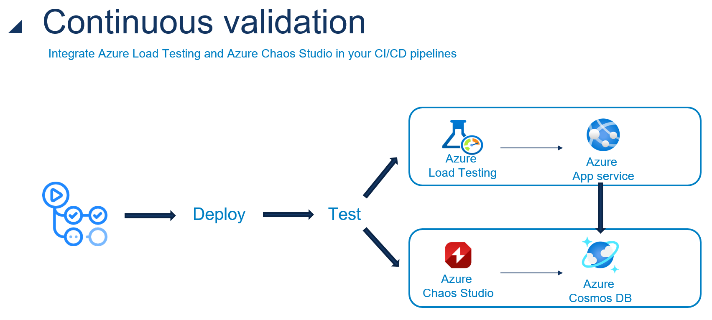

# CraftedSpecially
Craft beer company that suits their customers reviews to create new craft beer flavours

ByteBrew: Crafting the Future of Technology

## Continuous Validation
Non-functional requirements define the quality of a system. They are not directly related to the behaviour of the system, but to properties such as reliability, response time and scalability.

[Continuous validation](https://learn.microsoft.com/en-us/azure/well-architected/mission-critical/mission-critical-deployment-testing#continuous-validation-and-testing) is the process of continuously checking whether the system meets its non-functional requirements. This is done by running tests that measure the non-functional properties of the system. Theses tests are ran against the system under normal circumstances and under stress. The results of these tests are then compared to the non-functional requirements.

### Getting started
To get started with continuous validation these steps need to be taken:
- Setup the environment for continuous validation. This is done in the [github workflow `infrastructure-deployment.yml`](./.github/workflows/infrastructure-deployment.yml). This workflow will deploy the infrastructure needed to run the tests. The bicep files that are deploying the needed resources for continuous validation are located in the folder [infrastructure/management-governance](./Infrastructure/management-governance/continuous-validation/).

- The actual validation is done in the [github workflow `catalog-service.yml`](./.github/workflows/catalog-service.yml). This workflow does the following steps:
    - Deploy the catalog service to the environment
    - Run a loadtest under normal circumstances
    - Run a loadtest under chaos circumstances

## Mutation testing
test ......